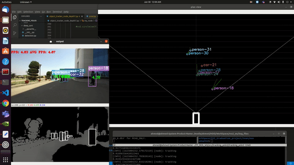
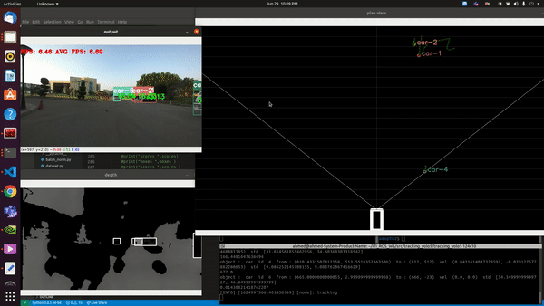

# Object Tracking using YOLOv5, Deep Sort ,bird view using depth estimation and Prediction using UKF
This repository contains an implementation of a ROS2 Node that subscribes to a RGB image's topic and a depth image's topic, the node then uses YOLO5 and Deep SORT in order to perfrom a real-time object detection and tracking. then the detections are fed into Deep SORT (Simple Online and Realtime Tracking with a Deep Association Metric) in order to track the objects using features matching and kalman filter. the node uses the detections in the RGB image and the depth image to calculate the detected objects' position in the bird's eye view where the motion is tracked and predicted using Unscented Kalman Filter (UKF).

yolo3 and yolo5 were tested on this code.

## The Project's Pipeline:

### Objects Detection

### Objects' Tracking

### Object's Position Calculation in Bird's Eye View using the Depth Image

### Motion Prediction in the BEV

### Motion Prediction 2 in the BEV

## Getting started

#### Conda (Recommended)
conda create -n <env_name> python=3.8

then install all requirements in yolo5 requirements file

#### to run 

python object_tracker_node_depth.py

##### for depth estimation you can use zed2 camrea for high accuracy but any other method can be used

## Acknowledgments
* [yolov5 torch](https://github.com/ultralytics/yolov5)
* [Yolov3 TensorFlow Amazing Implementation](https://github.com/zzh8829/yolov3-tf2)
* [Deep SORT Repository](https://github.com/nwojke/deep_sort)
* [Yolo v3 official paper](https://arxiv.org/abs/1804.02767)
