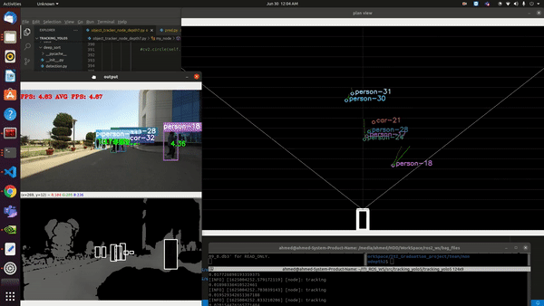
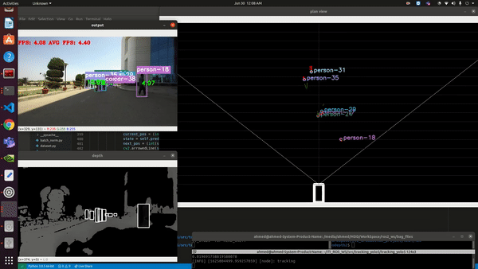
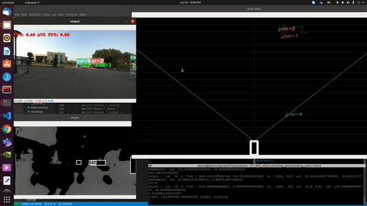

# Object Tracking using YOLOv5, Deep Sort ,bird view using depth estimation and Prediction using UKF
This repository implements a ROS2 None contains YOLO5 Deep SORT in order to perfrom real-time object tracking. Yolov5 is an algorithm that uses deep convolutional neural networks to perform object detection. We can feed these object detections into Deep SORT (Simple Online and Realtime Tracking with a Deep Association Metric) in order for a real-time object tracker to be created. Then subscribe to a depth image from zed2 camera or any other depth estimation method to get the bird view then predect the motion of objects using UKF.

yolo3 and yolo5 were tested on this code, you can use any.

#project pipeline

## Getting started

#### Conda (Recommended)
conda create -n <env_name> python=3.8

then install all requirements in yolo5 requirements file

## Acknowledgments
* [yolov5 torch](https://github.com/ultralytics/yolov5)
* [Yolov3 TensorFlow Amazing Implementation](https://github.com/zzh8829/yolov3-tf2)
* [Deep SORT Repository](https://github.com/nwojke/deep_sort)
* [Yolo v3 official paper](https://arxiv.org/abs/1804.02767)
